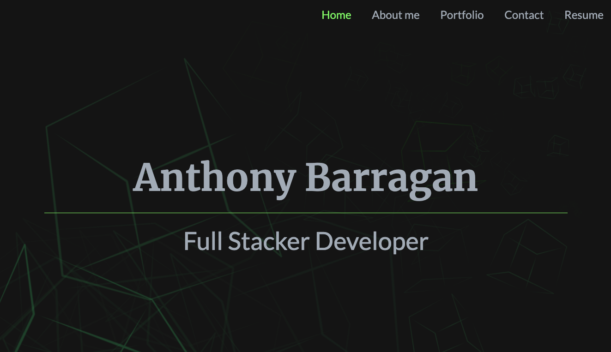

  # react-portfolio [](http://unlicense.org/)
  
  ## Description
  This is my react portfolio website. I've included react packages for sound effects, some Bootstrap, lots of custom CSS, and scroll animations. This portfolio continues to be a work-in-progress.
  ## Tables of Contents
  1. [Installation](#installation)
  2. [Usage](#usage)
  3. [Contribution](#contribution)
  4. [Tests](#tests)
  5. [License](#license)
  6. [Questions](#questions)
  ## Installation
  To install the necessary dependencies, run the following command.
  ```
  npm install
  ```
  ## Usage
  [Deployed Site](https://abarragan89.github.io/react-portfolio/)
  ## Contribution
  Fork and make a pull request
  ## Tests
  ```
  NA
  ```
  ## License 
  This applicaiton is licensed under the The Unlicense license.
  ## Questions
  If you have any questions:

  [GitHub Acccount](https://github.com/abarragan89)

  Email: anthony.bar.89@gmail.com
